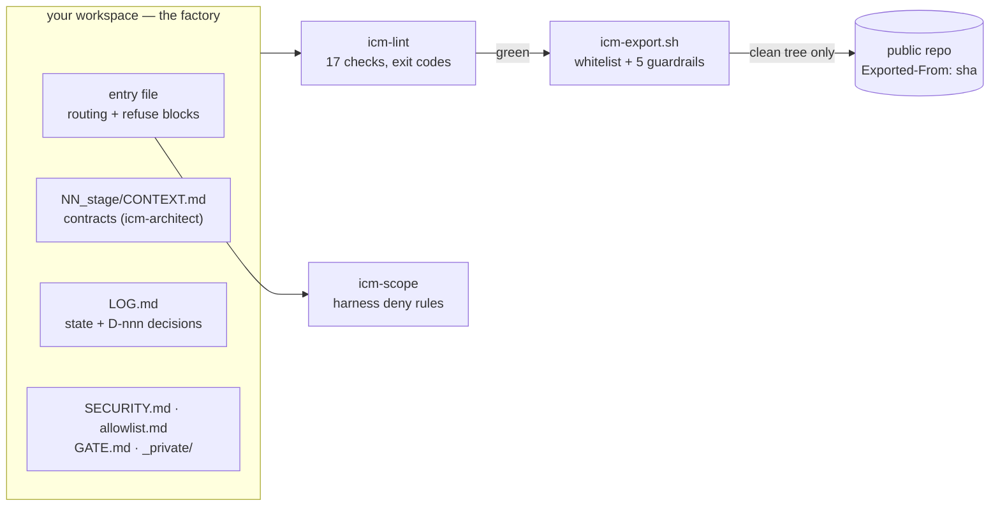

# icm-shipwright

[](https://github.com/binnukarunakar/icm-shipwright/actions/workflows/ci.yml)
[](LICENSE)
[](https://arxiv.org/abs/2603.16021)

The production layer for ICM workspaces. **icm-architect designs the
workspace; icm-shipwright makes it safe to run and ships it.**

[ICM](https://arxiv.org/abs/2603.16021) (Interpretable Context Methodology)
turns folder structure into agent architecture — numbered folders carry
sequencing, markdown contracts carry control, files carry state.
[icm-architect](https://github.com/RinDig/icm-architect) builds that control
plane. Shipwright adds the two planes every real deployment grows by hand:

- **Trust** — who may read what (scoped identities with refuse blocks, made
  harness-enforceable), fetch what (a dated, scoped, *expiring* egress
  allowlist), claim what (cite-or-refuse with self-expiring baselines), and
  build what at all (GATE files an agent can't talk its way past).
- **Ops** — the machine-checkable slice of the walk test as a lint (17
  checks, exit codes, CI — including Cliff's 2–8k token budget per stage), one
  file for session state, a whitelist exporter with five fail-closed guardrail
  families and commit provenance, board + QA conventions, and a pain-triggered
  maturity ladder from empty folder to team production.

One law governs both: a rule may exist as prose only if a machine check backs
it. Everything else was cut.

## How it works



Everything grows along a pain-triggered ladder — never speculatively:

```
0 prompt · 1 folder · 2 contracts · 3 lint · 4 trust · 5 publish · 6 team
```

## Quickstart (10 minutes)

1. `git clone https://github.com/binnukarunakar/icm-shipwright ~/.claude/skills/icm-shipwright`
   (or `.claude/skills/` inside a project; other agents: read `AGENTS.md`).
2. Say **"set up my workspace with icm-shipwright"** and pick a profile —
   personal, startup, or company (business-ops / engineering / marketing).
3. The agent copies the profile's templates (including `.gitignore`), copies
   the four script files into `tools/`, runs `git init`, and hands you a
   green lint.
4. When something must leave the machine: **"publish this"** — manifest,
   export, guardrails, review, push.

## What the lint says

Real output against a **deliberately broken demo workspace** (not this repo —
the badge above is this repo's actual state). This is what a stranger's messy
folder looks like to the lint:

```
$ python3 tools/icm-lint .
WARN C7 . — no LOG.md — sessions have no state file to resume from (rung 1)
ERROR T1 . — _private/ exists but is not gitignored — it will be committed
ERROR C3 01_intake/CONTEXT.md — contract is missing its '## Inputs' section
ERROR C3 01_intake/CONTEXT.md — contract is missing its '## Process' section
ERROR C3 01_intake/CONTEXT.md — contract is missing its '## Outputs' section
ERROR C3 01_intake/CONTEXT.md — contract is missing its '## Human check' section
ERROR C6 CLAUDE.md — routing link does not resolve: missing.md
icm-lint: 7 finding(s) (6 errors, 1 warnings)
$ echo $?
1
```

Every ID maps to a cause and a fix in
[references/checks.md](references/checks.md). Apply the seven fixes it names
(a LOG.md, a `.gitignore` line, the four contract sections, one repaired
link) and run again:

```
$ python3 tools/icm-lint .
icm-lint: 0 finding(s) (0 errors, 0 warnings)
$ echo $?
0
```

That exit code is the whole product: CI blocks on it, pre-commit blocks on
it, and a green run means the structure is telling the truth. Disagree with
a finding honestly via a `skip <ID> [path]` line in `.icmlint` — a recorded
exception a reviewer can see.

## Layout

```
SKILL.md              the method: planes, four modes, route-by-what-hurts, ladder
AGENTS.md             portability: any agent, any CI
references/           control-plane deltas · trust plane · ops plane · check playbook
assets/templates/     entry file, LOG, SECURITY, allowlist, identity, GATE,
                      BOARD, publish.manifest, stage contract, CI workflow
assets/scripts/       icm-lint · icm-export.sh · icm-scope · scrub-patterns.txt
profiles/             personal · startup · company (+ 3 department variants)
tests/                run.sh — every check and guardrail proven by a seeded
                      violation; CI runs it on GNU and BSD tools
```

## Contributing

`bash tests/run.sh` must stay green, and the one law binds PRs too: a new
rule lands only with the machine check that backs it. Details in
[CONTRIBUTING.md](CONTRIBUTING.md); guardrail bypasses go privately via
[the security policy](.github/SECURITY.md), never the issue tracker.

## Credits

Method: Van Clief & McDermott, *Interpretable Context Methodology: Folder
Structure as Agent Architecture*, [arXiv:2603.16021](https://arxiv.org/abs/2603.16021)
(MIT). Control plane: [RinDig's icm-architect](https://github.com/RinDig/icm-architect),
inherited by reference and never duplicated. Trust and ops mechanisms:
generalized from a multi-project production deployment run since 2026.

MIT licensed, like the protocol it serves.
